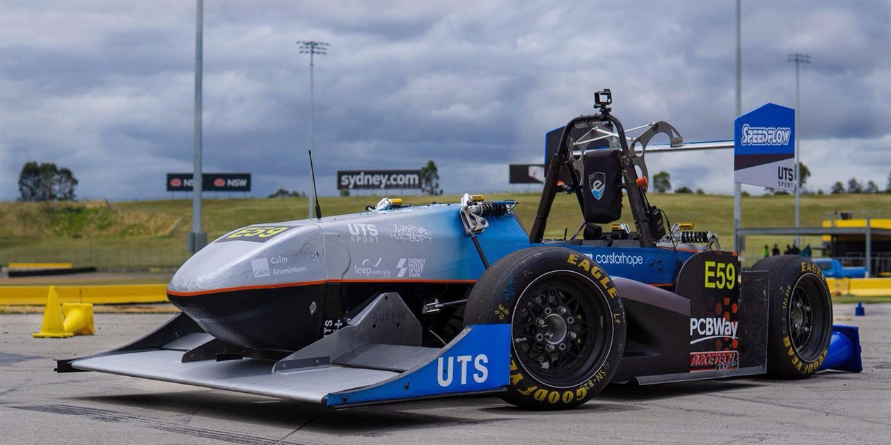
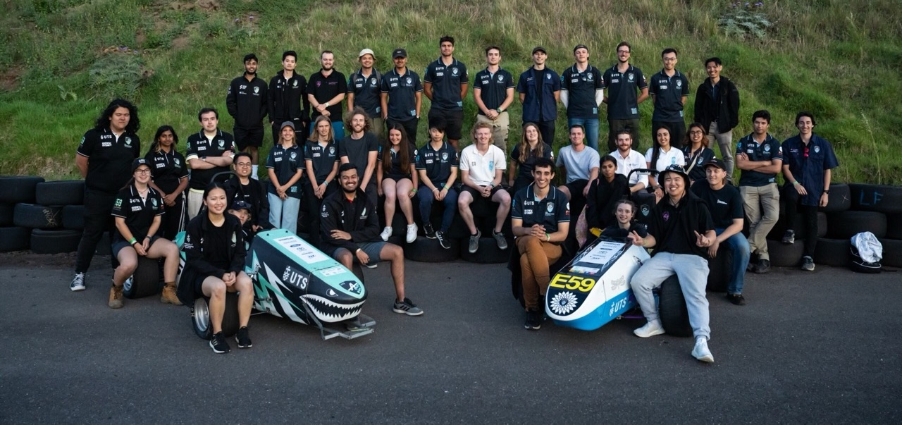

# UTS Motorsports Electric Car Project

Welcome to the official GitHub organization for the UTS Motorsports Electric Car Project! This repository is dedicated to the development and collaboration of the UTS Motorsports Electric (UTSME) team, a student-based group representing the University of Technology Sydney (UTS) in national and international competitions such as Formula SAE-Australasia and F-S Sydney.

## About Us

The UTS Motorsports Electric Car Project was established in 1999 as UTS Motorsports. Initially competing with internal combustion cars, the team has transitioned to electric vehicles, showcasing innovation and sustainability. Our continued work and improvement, is a testament to our commitment to cutting-edge technology and engineering excellence.

Our team comprises undergraduate and postgraduate students from various disciplines, including engineering, science, business, and information technology. We are also supported by academics and university consultants who provide guidance and expertise.

## Learning Opportunities

Participating in the UTS Motorsports Electric Car Project offers students a unique opportunity to:

- **Develop Practical Knowledge:** Gain hands-on experience in designing and manufacturing a Formula-style electric race car.
- **Collaborate with Industry:** Engage in marketing activities and outreach programs that elevate UTS's status as a leading technology university.
- **Inspire Innovation:** Contribute to a visionary project that shapes the future of electric vehicles.
- **Enhance Academic and Social Development:** Work on a project that pushes the boundaries of academic and social growth.

### Skills Developed

- **Technical, Research, and Problem-Solving:** Enhance your technical expertise, research capabilities, and critical thinking.
- **Collaboration and Personal Management:** Learn to plan, organize, and execute projects independently while collaborating with a diverse team.
- **Creativity and Technology:** Apply creative solutions and advanced technology to real-world challenges.

## Join Us

We welcome students from all programs to apply and be part of this exciting project. There are **student positions** available, offering a chance to:

- **Create Job-Ready Skills:** Develop skills that increase productivity and boost research capabilities.
- **Inspire Leadership and Innovation:** Be part of a team that produces future leaders and innovators.
- **Contribute to Industry:** Engage with industry partners and explore sponsorship opportunities.
- **Specialize or Diversify:** Focus on specialized areas of interest or gain exposure to various facets of the project.

## How to Get Involved

#### Work In Progress

## Repository Structure

#### Work In Progress

## Contributing

#### Work In Progress
